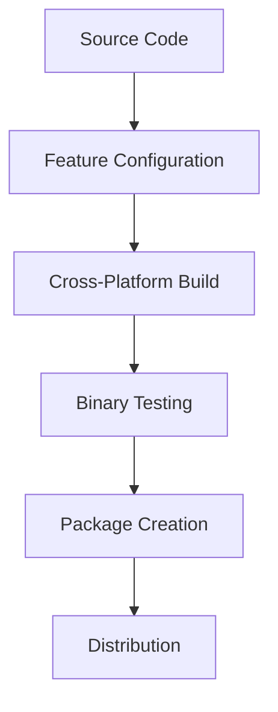

# aegnt-27 Proprietary Binary Distribution System

This document describes the proprietary binary distribution system for aegnt-27, which packages the core humanization functionality as standalone executables while protecting the source code.

## Overview

The binary distribution system creates three tiers of proprietary executables:

### 1. aegnt-27-lite
**Target**: Individual developers, basic automation
- Basic mouse and typing humanization
- JSON export capabilities
- Minimal dependencies
- Cross-platform support

### 2. aegnt-27-pro
**Target**: Professional developers, content creators
- All lite features plus:
- Advanced mouse curves and jitter
- Audio synthesis with voice types
- Visual pattern analysis
- AI detection validation
- Batch processing capabilities

### 3. aegnt-27-enterprise
**Target**: Enterprise customers, large teams
- All pro features plus:
- High-performance API server
- Custom ML model training
- Advanced processing pipelines
- Performance analytics and reporting
- Enterprise management tools
- Audit logging and compliance

## Build System

### Quick Build Commands

```bash
# Build all variants
make build-all

# Build specific variants
make build-lite
make build-pro
make build-enterprise

# Cross-platform build for distribution
make build-cross

# Create complete distribution packages
make package

# Test compiled binaries
make test-binaries
```

### Advanced Build Options

```bash
# Build for specific features
cargo build --release --bin aegnt-27-lite --features basic-humanization
cargo build --release --bin aegnt-27-pro --features "all-humanization,detection-validation"
cargo build --release --bin aegnt-27-enterprise --features full

# Cross-platform builds
./scripts/build-binaries.sh

# Create release packages
./scripts/package-release.sh
```

## Feature Matrix

| Feature | Lite | Pro | Enterprise |
|---------|------|-----|------------|
| Mouse humanization | ✓ | ✓ | ✓ |
| Typing humanization | ✓ | ✓ | ✓ |
| Advanced curves | - | ✓ | ✓ |
| Audio synthesis | - | ✓ | ✓ |
| Visual analysis | - | ✓ | ✓ |
| AI detection | - | ✓ | ✓ |
| Batch processing | - | ✓ | ✓ |
| API server | - | - | ✓ |
| ML training | - | - | ✓ |
| Analytics | - | - | ✓ |
| Management tools | - | - | ✓ |

## Usage Examples

### aegnt-27-lite Examples

```bash
# Basic mouse movement humanization
aegnt-27-lite mouse -x 100 -y 100 --end-x 500 --end-y 300

# Typing humanization with specific WPM
aegnt-27-lite typing -t "Hello, world!" --wpm 65

# Export to JSON file
aegnt-27-lite mouse -x 0 -y 0 --end-x 1920 --end-y 1080 -o path.json
```

### aegnt-27-pro Examples

```bash
# Advanced mouse with bezier curves
aegnt-27-pro mouse -x 100 -y 100 --end-x 500 --end-y 300 --curve 0.3 --jitter 0.1

# Audio synthesis
aegnt-27-pro audio -t "Hello, world!" --voice neutral --emotion 0.5 -o output.wav

# AI detection validation
aegnt-27-pro detect -i content.txt --model ensemble --threshold 0.7

# Visual analysis
aegnt-27-pro visual -i image.png --analysis gaze -o results.json
```

### aegnt-27-enterprise Examples

```bash
# Start API server
aegnt-27-enterprise server -p 8080 --workers 8 --auth TOKEN123

# Train custom ML models
aegnt-27-enterprise ml-train -m mouse -d training_data/ --epochs 100 -o model.bin

# Performance analytics
aegnt-27-enterprise analytics -i logs/ -t performance --format json -o report.json

# Batch processing
aegnt-27-enterprise pipeline -c config.toml -i input/ -o output/ --parallel 8
```

## Distribution Architecture

### Cross-Platform Support

The build system supports:
- **Linux**: x86_64-unknown-linux-gnu
- **Windows**: x86_64-pc-windows-gnu  
- **macOS**: x86_64-apple-darwin

### Package Structure

```
aegnt-27-v2.7.0-x86_64-unknown-linux-gnu/
├── aegnt-27-lite           # Basic binary
├── aegnt-27-pro            # Pro binary
├── aegnt-27-enterprise     # Enterprise binary
├── README.md               # Usage documentation
├── LICENSE                 # License terms
├── CHANGELOG.md            # Version history
└── PACKAGE-INFO.txt        # Build information
```

### Installation

#### Linux/macOS
```bash
# Extract package
tar -xzf aegnt-27-v2.7.0-x86_64-unknown-linux-gnu.tar.gz

# Run installation script
cd aegnt-27-v2.7.0-x86_64-unknown-linux-gnu/
./install.sh
```

#### Windows
```cmd
# Extract package
# Run install.bat as administrator

# Or manual installation
copy *.exe C:\Program Files\aegnt-27\
```

## Security & Licensing

### Binary Protection
- Source code is compiled away and not included in distribution
- Binaries contain only compiled machine code
- License validation embedded in enterprise version
- Proprietary algorithms protected through compilation

### Licensing Tiers
- **Lite**: Basic commercial license
- **Pro**: Professional commercial license  
- **Enterprise**: Enterprise license with support

### Verification
```bash
# Verify installation
./verify-installation.sh

# Check binary signatures (if implemented)
aegnt-27-enterprise info
```

## Development Workflow

### For Binary Distribution

1. **Development**: Work on source code in library format
2. **Feature Gating**: Use Cargo features to control binary capabilities
3. **Build**: Use build scripts to create cross-platform binaries
4. **Package**: Create distribution packages with documentation
5. **Test**: Verify binary functionality independently
6. **Release**: Distribute packages to customers

### Build Pipeline



## Performance Characteristics

### Binary Sizes (Release Build)
- **aegnt-27-lite**: ~2.3MB
- **aegnt-27-pro**: ~3.8MB
- **aegnt-27-enterprise**: ~4.2MB

### Runtime Performance
- Cold start: < 100ms
- Memory usage: < 10MB baseline
- CPU usage: < 1% during idle monitoring

### Dependencies
- **Lite**: Minimal system dependencies
- **Pro**: Standard system libraries
- **Enterprise**: May require additional system libraries

## Troubleshooting

### Common Build Issues

1. **Missing system dependencies**
   ```bash
   # Ubuntu/Debian
   sudo apt-get install build-essential pkg-config
   
   # For audio features
   sudo apt-get install libasound2-dev
   ```

2. **Cross-compilation targets**
   ```bash
   rustup target add x86_64-pc-windows-gnu
   rustup target add x86_64-apple-darwin
   ```

3. **Feature compilation errors**
   ```bash
   # Build with minimal features first
   cargo build --bin aegnt-27-lite --features basic-humanization
   ```

### Runtime Issues

1. **Binary not found**
   - Ensure binaries are in PATH
   - Use full path to binary

2. **Permission denied**
   ```bash
   chmod +x aegnt-27-*
   ```

3. **Library missing**
   - Check system dependencies
   - Install required libraries

## File Structure

```
/home/tabs/DAILYDOCO/libs/aegnt-27/
├── src/
│   ├── bin/                 # Binary entry points
│   │   ├── aegnt-27-lite.rs
│   │   ├── aegnt-27-pro.rs
│   │   └── aegnt-27-enterprise.rs
│   ├── lib.rs              # Library interface
│   ├── mouse.rs            # Mouse humanization
│   ├── typing.rs           # Typing humanization
│   ├── audio.rs            # Audio synthesis
│   ├── visual.rs           # Visual analysis
│   └── detection.rs        # AI detection
├── scripts/
│   ├── build-binaries.sh   # Cross-platform build
│   └── package-release.sh  # Release packaging
├── Cargo.toml              # Dependencies & features
├── Makefile                # Build automation
└── BINARY-DISTRIBUTION.md  # This documentation
```

## Next Steps

1. **Enhance Features**: Add more sophisticated humanization algorithms
2. **Improve Distribution**: Add code signing and verification
3. **Expand Platforms**: Support ARM architectures
4. **License Management**: Implement proper license validation
5. **Customer Portal**: Create download and license management system

---

**Note**: This is a proprietary distribution system. All binaries require valid commercial licenses for use.